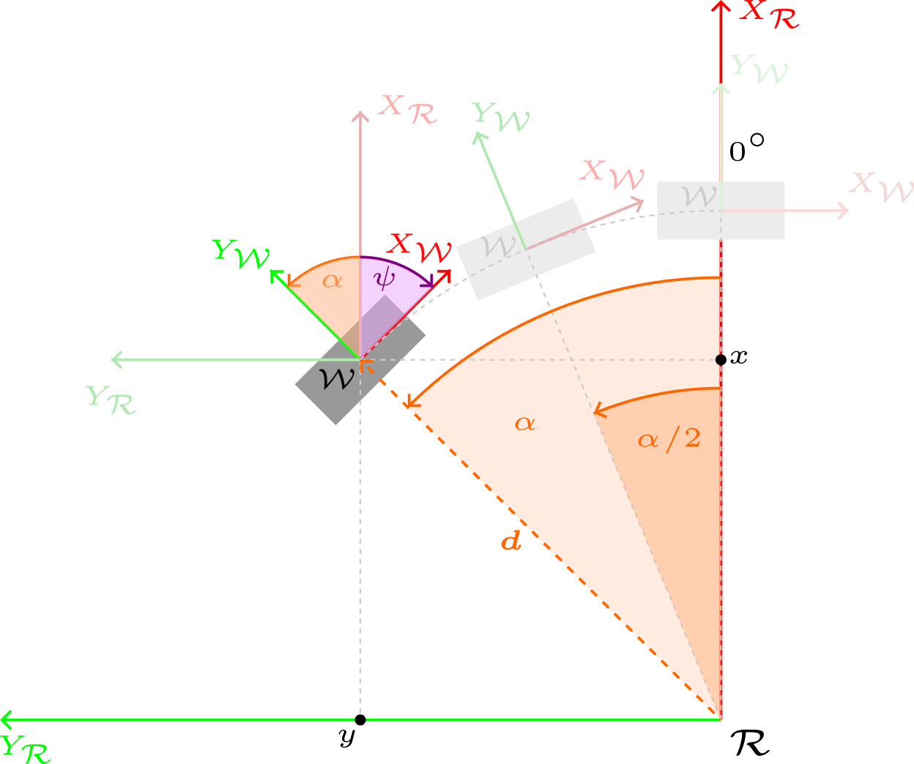
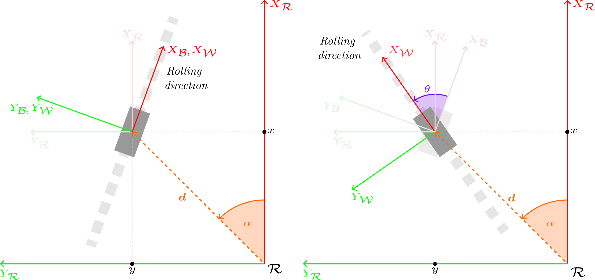
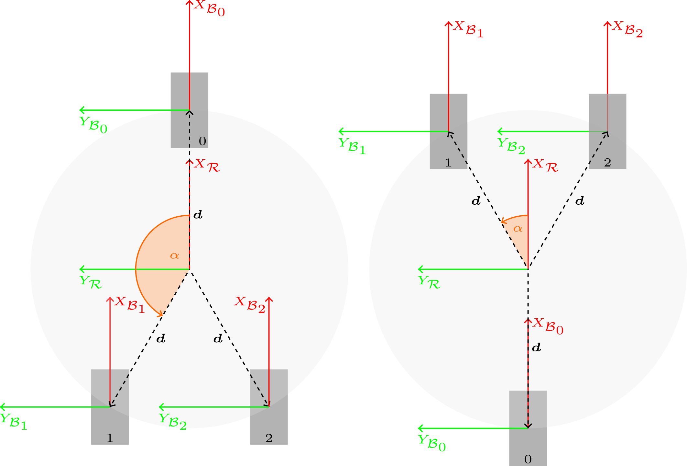

# Cinemática de Robots Terrestres

### Un Marco Generalizado para la Cinemática Directa e Inversa de Robots con Ruedas

> *Desarrollo analítico riguroso de la cinemática de ruedas — desde los principios fundamentales hasta resolvedores numéricos basados en SVD.*

---

## ¿Qué es esto?

Un documento técnico autocontenido que construye — desde cero — un **marco cinemático unificado** para robots terrestres con ruedas. Ya sea que estés trabajando con un sencillo robot diferencial, un coche tipo Ackermann, una plataforma con ruedas Mecanum o un swerve drive completo, la misma formulación matricial es aplicable.

El documento está disponible en dos idiomas:

| Idioma  | PDF | Fuente LaTeX |
|---------|-----|--------------|
| Inglés  | [kinematics_en.pdf](kinematics_en.pdf) | [kinematics_en.tex](kinematics_en.tex) |
| Español | [kinematics_es.pdf](kinematics_es.pdf) | [kinematics_es.tex](kinematics_es.tex) |

---

## Qué encontrarás dentro

### 1 · Restricciones de movimiento impuestas por las ruedas

Un enfoque basado en sistemas de referencia para modelar cómo cada rueda restringe el movimiento del chasis. Se cubre:

- La **restricción de no deslizamiento lateral** para ruedas convencionales (orientables y no orientables).
- Por qué las ruedas **Mecanum / omnidireccionales** rompen esa restricción y qué implica.
- El **sistema de referencia base de la rueda** $\mathcal{B}_i$: una referencia estable e invariante en el tiempo, anclada al punto de montaje de cada rueda, que hace que la derivación matricial sea limpia y general.

  
  

### 2 · Una única ecuación matricial para cualquier plataforma con ruedas

Para un robot con $N$ ruedas, la cinemática se reduce a:

$$A\mathbf{x} = \mathbf{b}, \qquad A \in \mathbb{R}^{2N \times 3}$$

donde $\mathbf{x} = [V_{r,x},\; V_{r,y},\; \omega_{r,z}]^\top$ es la velocidad del chasis y $\mathbf{b}$ apila las medidas individuales de velocidad de cada rueda. Como $2N > 3$ para cualquier robot práctico, el sistema está **sobredeterminado** — y eso es una ventaja, no un inconveniente.

### 3 · Mínimos cuadrados, pseudoinversa y SVD

Los robots reales conviven con ruido en los encoders, deslizamiento de ruedas y errores de calibración. El documento desarrolla:

- Por qué las **Ecuaciones Normales** $(A^\top A)^{-1} A^\top \mathbf{b}$ pueden ser numéricamente catastróficas.
- Cómo la **Descomposición en Valores Singulares** $A = U \Sigma V^\top$ proporciona la pseudoinversa de Moore-Penrose $A^+ = V \Sigma^+ U^\top$ de forma fiable y segura — con una demostración algebraica completa, paso a paso.
- El **número de condición** $\kappa = \sigma_{\max} / \sigma_{\min}$ como herramienta de diagnóstico: cómo interpretarlo, por qué un $\kappa$ alto revela un *defecto en el diseño mecánico*, y por qué la SVD nunca debe usarse como excusa para ignorar una mala geometría.

### 4 · Topologías de robots concretas resueltas en detalle

| Plataforma | Cinemática inversa | Cinemática directa |
|------------|-------------------|-------------------|
| Swerve drive de tres ruedas (Y / Y invertida) | ✓ | ✓ |
| Swerve drive de cuatro ruedas | ✓ | ✓ |
| *(el mismo marco es aplicable a diferencial, Ackermann, Mecanum)* | | |

  

---

## ¿Para quién es esto?

- Ingenieros de robótica que implementan **odometría de ruedas** o **estimadores de velocidad del chasis**.
- Estudiantes que aprenden a derivar cinemáticas de forma sistemática en lugar de caso por caso.
- Cualquiera que se haya preguntado *por qué* usar SVD en lugar de simplemente invertir una matriz.

---

## Prerrequisitos

El documento asume familiaridad con álgebra lineal básica (productos matriciales, transpuesta, valores propios) y cinemática de cuerpo rígido (sistemas de referencia, producto vectorial). Todo lo demás — SVD, pseudoinversa, número de condición — se deriva desde los principios fundamentales.

---

## Autor

**Juan Francisco Rascón Crespo**

---

*Se agradecen comentarios, correcciones y pull requests.*
